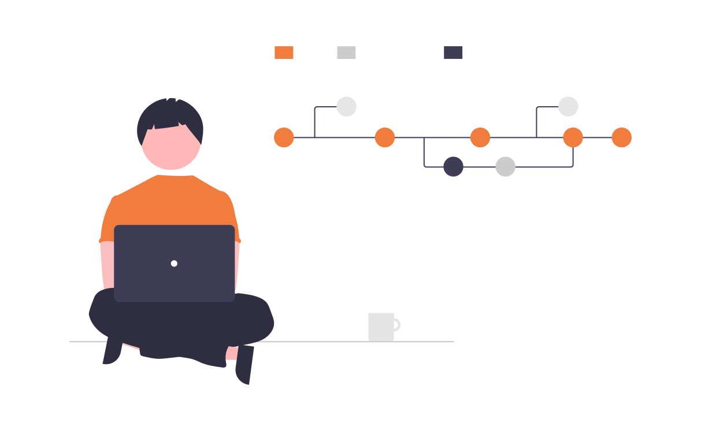

<p align="center">
    
</p>


## Hi , I'm [Muhammad Rameez!](https://www.linkedin.com/in/muhammadrmz) 

<!-- HaedLine !-->

    
<!--Profile view counter API!-->


<!-- Social Links !-->
 _Join the Ecosystem 💫_

<a href="https://linkedin.com/in/muhammadrmz">
  
</a>
<a href="https://github.com/ZapeeoSheikh">
  
</a>
<a href="https://bit.ly/muhammadrameez">
  
</a>
<a href="https://instagram.com/zapeeo_sheikh/">
  
</a>
<a href="https://www.facebook.com/ZapeeoSheikh/">
  
</a>
<a href="https://wa.me/923234879062">
    
</a>

<br/>

### About me 🚀
- 🌱 Works on **Flutter** by passion and **dotNet** by field
- 👯 Love to help people and grow as a community
- 👣 I like Chess and Badminton
- 💖 I am a creative [Artist](https://dribbble.com/muhammadrmz)
- ⚡ Fun fact ***I am a Mutlimindle***


```
    Human Information
    ------------------------------------------
    Name: Muhammad Rameez
    Useranme: Zapeeo Sheikh
    Gender: Male
    Age: 19
    Hobbies: ["Writing"], ["Coding"], ["Exploring"], ["Soft Music"]
    Languages: ["Urdu"], ["English US"], ["English UK"]
    University: Government College University, Lahore
```

<br>


### 📕 Blog Post
<!-- BLOG-POST-LIST:START -->
- [All about Flutter Widgets!](https://dev.to/zapeeosheikh/flutter-widgets-1mm9)
- [What is Flutter and Why Flutter!](https://dev.to/zapeeosheikh/flutter-experience-5dfg)
- [Diffrence between Bootstrap 3 and 4!](https://zapeeosheikh.medium.com/difference-between-bootstrap-3-and-bootstrap-4-abb338ee8bde)
- [All you need to know about SAP](https://zapeeosheikh.medium.com/what-is-sap-397e1be4ab53)
<!-- BLOG-POST-LIST:END -->




```
    Voluntering Information
    ------------------------------------------
    Campus Director @ Young International Conclave
    Graphics SUB-Head @ IEEE GCU Student Chapter
    Co Director IT @ GCU ACM Student Chapter
    Flutter Developer @ Flutter Lahore
    UI/UX Lead @ GDSC GCU
    Ambassador @ Great Learning
    Learn Student Ambassador @ Microsoft
```

### Languages and Tools:


<a href="https://www.w3.org/html/" target="_blank"></a>
<a href="https://www.w3schools.com/css/" target="_blank"></a>
<a href="https://www.cprogramming.com/" target="_blank">  </a>
<a href="https://www.w3schools.com/cpp/" target="_blank">  </a>
<a href="https://git-scm.com/" target="_blank">  </a>


</br>
</br>
    <div align="left">
<code></code>
<code></code>
<code></code>
<code></code>
<code></code>
<code></code>
<code></code>
<code></code>
<code></code> 
</div>


### Softwares:


<a href="https://www.adobe.com/products/xd.html" target="_blank">  </a> 
<a href="https://www.adobe.com/in/products/illustrator.html" target="_blank">  </a> 
<a href="https://www.photoshop.com/en" target="_blank">  </a>

<div align="left">

<code></code>
<code></code>
<code></code>
<code></code>
<code></code>
<code></code>

  
    
### Design & Prototype :
<div align="left">
<code></code>
<code></code>
</div>
 

</br>

### My Github Stats 🟠 
  
  [](https://github.com/ZapeeoSheikh)


<br>

&nbsp;&nbsp;

<br />
<p align = "center">

</p>
 <!--
 ​<b align = center>🏆 GitHub Profile Trophy: </b> 
 ​<p> 
 <a href="https://github.com/ZapeeoSheikh">
 
 ​</a> 
 ​</p> 
 ​<hr> 
-->
</details>
    
    
<div align="center">

### Show some ❤️ by starring some of the repositories!!
</div>

`Readme is Light Theme friendly`

